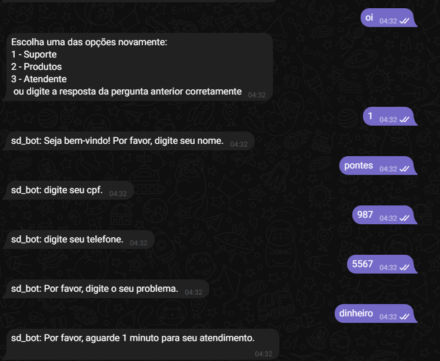

# goLangBotTelegram

# start in background:
docker-compose up --build -d 

# down:
docker-compose down

# Connection in browser main_api
http://localhost:8080

# Telegram token 

create .env file with key toke_telegram and value bot token
example: toke_telegram=bottoken

# api_main
    Port: 8080

# api_Produtos
    Port: 7070

# api_Suporte
    Port: 6060
    http://localhost:6060/
    http://localhost:6060/cpf
    http://localhost:6060/telefone
    http://localhost:6060/pergunta

# Api suporte exemplo de uso
* Pesquisar por sd_bot no telegram
* Iniciar a conversa

# Criando novo package
    go mod init  <package-name>
    go mod tidy

# build image
    docker build -f Dockerfile.suporte -t suporte-api:1.0 .

# Build image dockerfile por modulo
    docker build -f Dockerfile.suporte -t my-suporte-image .

# Executar container
    docker run -p 6060:6060 my-suporte-image
    docker run -d -p 6060:6060 --name suporte-api-container suporte-api:1.0

# Tree
├───atendente  atendente module
├───crud - file go to crud
├───dbconfig - file go to connect with db
├───produtos -  produtos module
├───suporte - handlers to suporte api
└───suporte_api - module api 